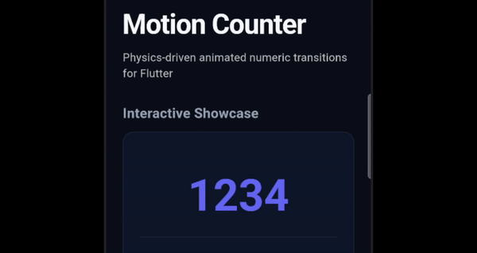
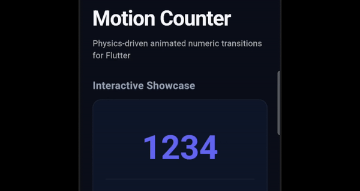

# Motion Counter

A production-grade Flutter package for animating numeric value changes with physics-driven, per-digit transitions.

Each digit behaves as an independent animated entity. Only the digits that actually change will animate, while unchanged digits remain perfectly still.

---

## Animation Styles Preview

| Odometer | Spring | Slot | Mechanical |
|:---:|:---:|:---:|:---:|
|  |  |  |  |


---

## Features

- **Physics-Based Transitions**: Individual digit controllers ensure smooth, realistic animations.
- **Cascading Stagger**: Optional cascade delays where animations roll from right-to-left or left-to-right.
- **Rich Formatting Options**: Integrates with the `intl` package to support grouping separators, decimals, prefixes, and suffixes.
- **Fixed-Width Padding (`minDigits`)**: Pad numbers with leading zeros (ideal for countdowns, timers, or fixed-width scoreboards).
- **Dynamic Animation Styles**:
  - `odometer`: Classic mechanical rolling digits.
  - `spring`: Elastic slide animation with physics overshoot and bounce.
  - `slot`: Rapid multi-revolution slot machine spin.
  - `mechanical`: Sharp snap-into-place transitions.

---

## Installation

Add `motion_counter` to your `pubspec.yaml` dependencies:

```yaml
dependencies:
  motion_counter: ^1.0.0
```

---

## Usage

### Basic Usage

Simply pass a `num` value (integer or double) to animate transitions whenever the value updates:

```dart
import 'package:motion_counter/motion_counter.dart';

MotionCounter(
  value: _counterValue,
)
```

### Choosing Animation Styles

Use named constructors to switch between transition physics and curves:

```dart
// Rolling mechanical wheels (Default)
MotionCounter.odometer(value: 1234)

// Bounce & overshoot spring transition
MotionCounter.spring(value: 1234)

// Spin multiple times like slot machine reels
MotionCounter.slot(value: 1234)

// Snap industrial style
MotionCounter.mechanical(value: 1234)
```

### Zero-Padding / Fixed Digit Width (`minDigits`)

Define a `minDigits` length so the integer part always maintains a fixed number of digits, padded with leading zeros (perfect for countdowns):

```dart
MotionCounter.odometer(
  value: 42,
  minDigits: 5, // Renders as "00042"
)
```

### Formatting & Specialized Factories

`MotionCounter` includes built-in factories to quickly format currencies, percentages, and large numbers:

```dart
// Currency (renders e.g. $1,234.56)
MotionCounter.currency(
  value: 1234.56,
  symbol: '\$',
  decimalDigits: 2,
)

// Percentages (renders e.g. 97.4%)
MotionCounter.percent(
  value: 97.4,
  decimalDigits: 1,
)

// Compact notation (renders e.g. 1.5M or 2.3K)
MotionCounter.compact(
  value: 1500000,
)
```

### Staggered Animations

Provide a cascade effect across digit updates (e.g. rightmost digits animate first) by setting a `stagger` delay:

```dart
MotionCounter.odometer(
  value: _value,
  stagger: const Duration(milliseconds: 50),
)
```

---

## Additional Information

For custom formatting, you can pass a custom `NumberFormat` from the `intl` package:

```dart
MotionCounter(
  value: 1234.56,
  numberFormat: NumberFormat.scientificPattern(),
)
```
